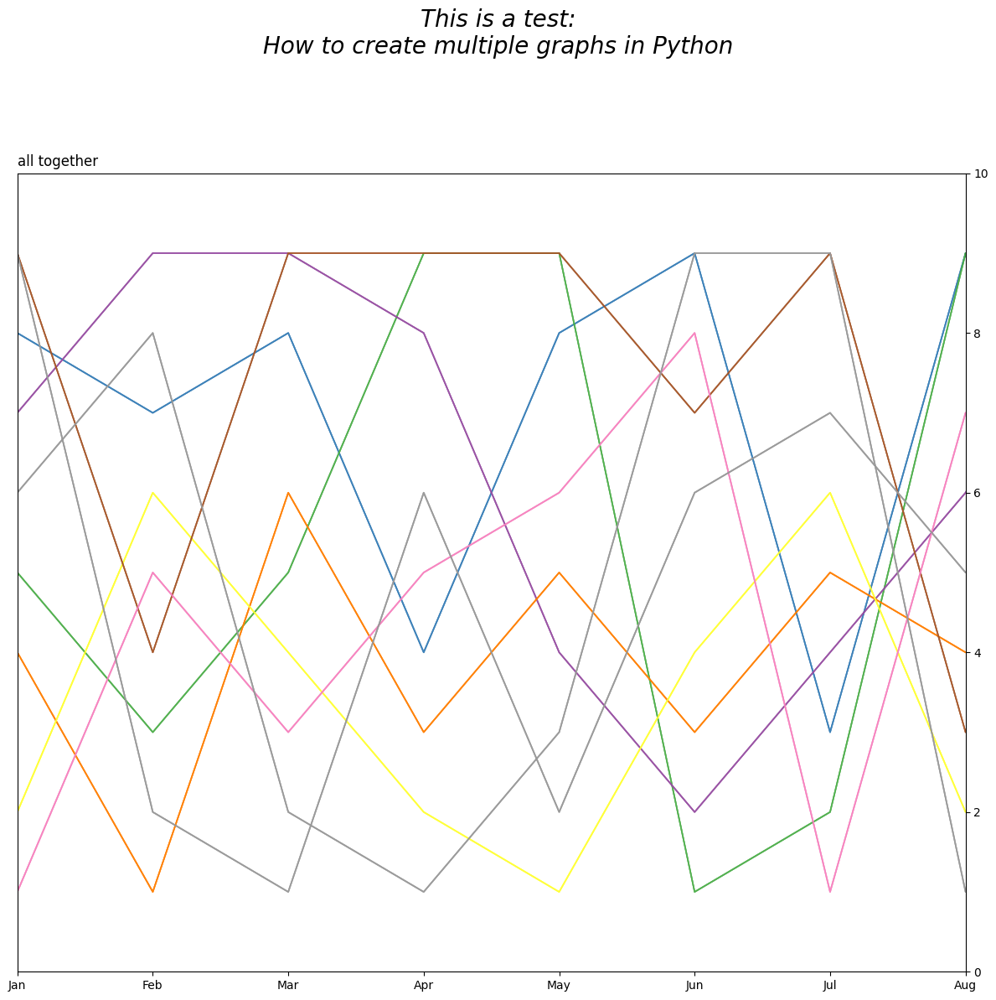
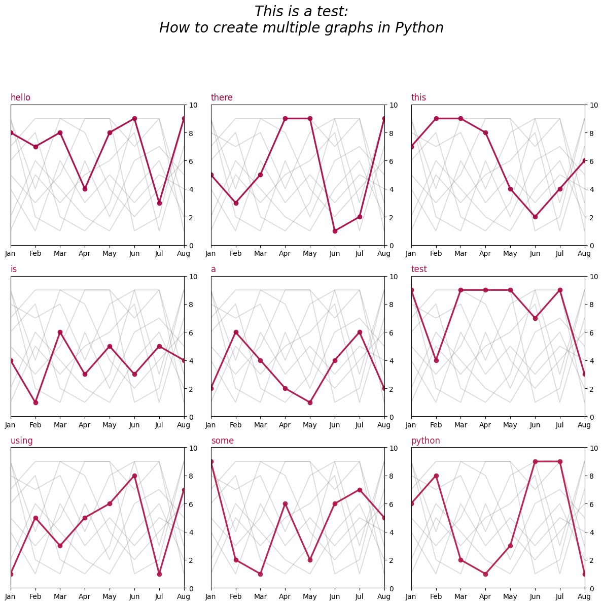

# Graphing Spaghetti Plots

This project was a quick test of how to use Python to generate multiple subplots, in order to cleanly graph a bunch of line plots and avoid a spaghetti plot.

The "test-data.csv" file was created from random sets of integers using [Random.org's random integer set generator](https://www.random.org/integer-sets), and is solely for demonstration.

## Before

This is what the graph looked like before the split. The "before.py" file was used to generate this look-alike.

## After

This is what a spaghetti plot *can* be made to look like, by splitting the original plot into multiple subplots. The "after.py" file was used to generate this set of subplots.

